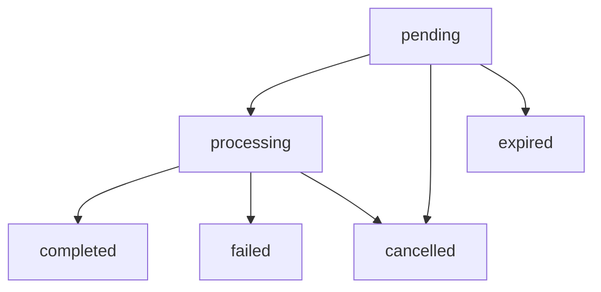

# Collections API Reference

The Collections API handles payment collection requests across all FundKit providers. This page documents the collection-specific interfaces, validation rules, and response formats.

## Collection Request

### `CollectionRequest` Interface

```typescript
interface CollectionRequest {
  amount: number;          // Amount in minor currency units (e.g., cents)
  currency: CurrencyCode;  // ISO 4217 currency code
  phoneNumber: string;     // International format with country code
  reason: string;          // Payment description/purpose
  reference?: string;      // Optional external reference ID
  metadata?: Record<string, any>; // Optional custom data
  webhook?: string;        // Optional webhook URL for status updates
  expiresAt?: string;      // Optional expiration timestamp (ISO format)
}
```

### Field Specifications

#### `amount`
- **Type**: `number`
- **Required**: Yes
- **Validation**: Must be positive integer
- **Format**: Minor currency units (e.g., 10000 = 100.00 UGX)
- **Limits**: Provider-specific (see provider limits below)

```typescript
// Valid amounts
amount: 1000    // 10.00 UGX
amount: 50000   // 500.00 UGX

// Invalid amounts
amount: -100    // Negative values not allowed
amount: 10.5    // Decimal values not allowed
amount: 0       // Zero values not allowed
```

#### `currency`
- **Type**: `CurrencyCode`
- **Required**: Yes
- **Supported Values**: `'UGX'`, `'KES'`, `'TZS'`, `'RWF'`
- **Validation**: Must be supported by at least one configured provider

```typescript
type CurrencyCode = 'UGX' | 'KES' | 'TZS' | 'RWF';

// Provider currency support
const currencySupport = {
  honeycoin: ['UGX', 'KES', 'TZS'],
  easypay: ['UGX'],
  tola: ['UGX', 'RWF']
};
```

#### `phoneNumber`
- **Type**: `string`
- **Required**: Yes
- **Format**: International format with country code
- **Validation**: Must match country-specific mobile number patterns

```typescript
// Valid phone numbers
phoneNumber: '+256701234567'  // Uganda
phoneNumber: '+254712345678'  // Kenya
phoneNumber: '+255712345678'  // Tanzania
phoneNumber: '+250712345678'  // Rwanda

// Invalid phone numbers
phoneNumber: '0701234567'     // Missing country code
phoneNumber: '256701234567'   // Missing + prefix
phoneNumber: '+1234567890'    // Unsupported country
```

#### `reason`
- **Type**: `string`
- **Required**: Yes
- **Validation**: Minimum 3 characters, maximum 255 characters
- **Purpose**: Displayed to customer during payment

```typescript
// Valid reasons
reason: 'Payment for order #12345'
reason: 'Monthly subscription fee'
reason: 'Top-up wallet balance'

// Invalid reasons
reason: ''          // Empty string
reason: 'OK'        // Too short
reason: 'A'.repeat(300) // Too long
```

#### `reference`
- **Type**: `string`
- **Required**: No
- **Purpose**: External reference for tracking
- **Validation**: Alphanumeric, maximum 50 characters

```typescript
// Valid references
reference: 'order-12345'
reference: 'subscription-abc123'
reference: 'invoice-2024-001'

// Invalid references
reference: 'order#12345'  // Special characters not allowed
reference: 'A'.repeat(60) // Too long
```

#### `metadata`
- **Type**: `Record<string, any>`
- **Required**: No
- **Purpose**: Store custom data with transaction
- **Limits**: Maximum 16KB when serialized

```typescript
// Valid metadata
metadata: {
  userId: '12345',
  orderType: 'subscription',
  plan: 'premium'
}

metadata: {
  customer: {
    name: 'John Doe',
    email: 'john@example.com'
  },
  items: ['item1', 'item2']
}
```

## Collection Response

### `CollectionResponse` Interface

```typescript
interface CollectionResponse {
  transactionId: string;         // Unique transaction identifier
  status: TransactionStatus;     // Current transaction status
  amount: number;               // Requested amount
  currency: CurrencyCode;       // Payment currency
  phoneNumber: string;          // Customer phone number
  reason: string;               // Payment description
  reference?: string;           // External reference (if provided)
  metadata?: Record<string, any>; // Custom metadata (if provided)
  providerTransactionId?: string; // Provider-specific ID
  providerData?: Record<string, any>; // Provider-specific data
  createdAt: string;            // Creation timestamp (ISO format)
  updatedAt: string;            // Last update timestamp (ISO format)
  expiresAt?: string;           // Expiration timestamp (if set)
  webhook?: string;             // Webhook URL (if provided)
}
```

### Response Wrapper

All collection operations return a `PayClientCollectionResponse`:

```typescript
interface PayClientCollectionResponse {
  provider: ProviderName;        // Selected provider
  data: CollectionResponse;      // Transaction data
}

type ProviderName = 'honeycoin' | 'easypay' | 'tola';
```

## Transaction Status Flow

### `TransactionStatus` Enum

```typescript
type TransactionStatus = 
  | 'pending'       // Payment initiated, awaiting customer action
  | 'processing'    // Customer action completed, processing payment
  | 'completed'     // Payment successful
  | 'failed'        // Payment failed
  | 'cancelled'     // Payment cancelled by customer or system
  | 'expired';      // Payment request expired
```

### Status Transitions



## Provider Limits

### Amount Limits

| Provider | Currency | Minimum | Maximum |
|----------|----------|---------|---------|
| HoneyCoin | UGX | 1,000 (10 UGX) | 10,000,000 (100,000 UGX) |
| HoneyCoin | KES | 100 (1 KES) | 1,000,000 (10,000 KES) |
| HoneyCoin | TZS | 1,000 (10 TZS) | 5,000,000 (50,000 TZS) |
| EasyPay | UGX | 500 (5 UGX) | 5,000,000 (50,000 UGX) |
| Tola | UGX | 1,000 (10 UGX) | 20,000,000 (200,000 UGX) |
| Tola | RWF | 100 (1 RWF) | 2,000,000 (20,000 RWF) |

## Validation Functions

### Client-Side Validation

```typescript
import { validateCollectionRequest } from '@fundkit/core/utils';

const validation = validateCollectionRequest({
  amount: 10000,
  currency: 'UGX',
  phoneNumber: '+256701234567',
  reason: 'Test payment'
});

if (!validation.isValid) {
  console.log('Validation errors:', validation.errors);
}
```

### Custom Validation Rules

```typescript
interface ValidationRule {
  field: keyof CollectionRequest;
  message: string;
  validator: (value: any) => boolean;
}

const customRules: ValidationRule[] = [
  {
    field: 'amount',
    message: 'Amount must be at least 1000',
    validator: (amount) => amount >= 1000
  },
  {
    field: 'phoneNumber',
    message: 'Only Uganda numbers allowed',
    validator: (phone) => phone.startsWith('+256')
  }
];
```

## Error Handling

### Collection-Specific Errors

```typescript
// Amount validation error
{
  name: 'ValidationError',
  code: 'INVALID_AMOUNT',
  message: 'Amount must be positive',
  field: 'amount',
  value: -100
}

// Currency not supported error
{
  name: 'ValidationError',
  code: 'UNSUPPORTED_CURRENCY',
  message: 'Currency USD not supported by any provider',
  field: 'currency',
  value: 'USD'
}

// Phone number format error
{
  name: 'ValidationError',
  code: 'INVALID_PHONE_NUMBER',
  message: 'Phone number must be in international format',
  field: 'phoneNumber',
  value: '0701234567'
}

// Provider limit exceeded
{
  name: 'ProviderError',
  code: 'AMOUNT_LIMIT_EXCEEDED',
  message: 'Amount exceeds provider maximum',
  provider: 'easypay',
  limit: 5000000,
  requested: 10000000
}
```

## Usage Examples

### Basic Collection

```typescript
import { PaymentClient } from '@fundkit/core';

const client = new PaymentClient({
  honeycoin: { apiKey: 'your-api-key' }
});

try {
  const result = await client.collect({
    amount: 10000,
    currency: 'UGX',
    phoneNumber: '+256701234567',
    reason: 'Payment for order #12345'
  });
  
  console.log('Transaction ID:', result.data.transactionId);
  console.log('Provider:', result.provider);
} catch (error) {
  console.error('Collection failed:', error.message);
}
```

### Collection with Metadata

```typescript
const result = await client.collect({
  amount: 50000,
  currency: 'UGX',
  phoneNumber: '+256701234567',
  reason: 'Premium subscription',
  reference: 'sub-2024-001',
  metadata: {
    customerId: '12345',
    plan: 'premium',
    duration: '1 month'
  },
  webhook: 'https://yourapp.com/webhooks/payments'
});
```

### Collection with Expiration

```typescript
const expiresAt = new Date(Date.now() + 15 * 60 * 1000); // 15 minutes

const result = await client.collect({
  amount: 25000,
  currency: 'UGX',
  phoneNumber: '+256701234567',
  reason: 'Time-limited offer',
  expiresAt: expiresAt.toISOString()
});
```

### Handling Collection Errors

```typescript
try {
  const result = await client.collect(request);
} catch (error) {
  switch (error.code) {
    case 'INVALID_AMOUNT':
      console.log('Please enter a valid amount');
      break;
    case 'UNSUPPORTED_CURRENCY':
      console.log('Currency not supported');
      break;
    case 'INVALID_PHONE_NUMBER':
      console.log('Please enter a valid phone number');
      break;
    case 'AMOUNT_LIMIT_EXCEEDED':
      console.log(`Maximum amount is ${error.limit}`);
      break;
    default:
      console.log('Collection failed:', error.message);
  }
}
```

## Best Practices

1. **Validate Early**: Use client-side validation before API calls
2. **Handle Provider Limits**: Check amount limits for target providers
3. **Use References**: Include unique references for tracking
4. **Set Webhooks**: Use webhooks for real-time status updates
5. **Add Metadata**: Store relevant context for later use
6. **Handle Timeouts**: Set appropriate expiration times
7. **Retry Logic**: Implement retry for transient failures
8. **Error Messages**: Provide clear error messages to users