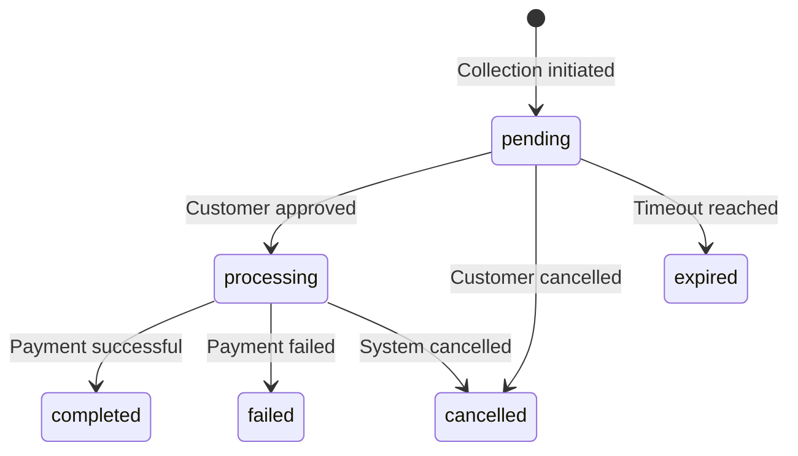

# Transactions API Reference

The Transactions API provides methods to check transaction status, retrieve transaction details, and manage transaction lifecycle across all FundKit providers.

## Transaction Status Operations

### `checkTransactionStatus(transactionId, provider?)`

Retrieves the current status and details of a transaction.

**Parameters:**
- `transactionId` (string): The transaction ID returned from collection request
- `provider` (string, optional): Specific provider to query (auto-detected if omitted)

**Returns:** `Promise<PayClientTransactionResponse>`

**Example:**
```typescript
// Check status with provider specified
const status = await client.checkTransactionStatus(
  'tx-abc123',
  'honeycoin'
);

// Check status with auto-detection
const status = await client.checkTransactionStatus('tx-abc123');

console.log(status.data.status); // 'completed'
console.log(status.provider); // 'honeycoin'
```

## Transaction Interfaces

### `TransactionResponse` Interface

```typescript
interface TransactionResponse {
  transactionId: string;         // FundKit transaction ID
  status: TransactionStatus;     // Current status
  amount: number;               // Transaction amount
  currency: CurrencyCode;       // Payment currency
  phoneNumber: string;          // Customer phone number
  reason: string;               // Payment description
  reference?: string;           // External reference
  metadata?: Record<string, any>; // Custom metadata
  
  // Provider-specific data
  providerTransactionId?: string; // Provider's transaction ID
  providerReference?: string;     // Provider's reference
  providerData?: Record<string, any>; // Raw provider response
  
  // Timestamps
  createdAt: string;            // Creation time (ISO format)
  updatedAt: string;            // Last update time (ISO format)
  completedAt?: string;         // Completion time (if completed)
  expiresAt?: string;           // Expiration time (if set)
  
  // Status details
  statusHistory?: StatusUpdate[]; // Status change history
  failureReason?: string;        // Failure reason (if failed)
  failureCode?: string;          // Provider failure code
  
  // Financial details
  fees?: TransactionFees;        // Transaction fees breakdown
  netAmount?: number;           // Amount after fees
}
```

### Response Wrapper

```typescript
interface PayClientTransactionResponse {
  provider: ProviderName;        // Provider that handled the transaction
  data: TransactionResponse;     // Transaction details
}
```

## Transaction Status

### `TransactionStatus` Types

```typescript
type TransactionStatus = 
  | 'pending'       // Awaiting customer action
  | 'processing'    // Processing payment
  | 'completed'     // Successfully completed
  | 'failed'        // Payment failed
  | 'cancelled'     // Cancelled by customer or system
  | 'expired';      // Request expired before completion
```

### Status Descriptions

| Status | Description | Customer Action | Next Steps |
|--------|-------------|-----------------|------------|
| `pending` | Payment request sent to customer's phone | Customer needs to approve payment on device | Wait for customer action or check status |
| `processing` | Customer approved, payment being processed | None required | Wait for final status |
| `completed` | Payment successful | None required | Payment complete |
| `failed` | Payment failed | May retry payment | Check failure reason |
| `cancelled` | Payment cancelled | May initiate new payment | Create new payment request |
| `expired` | Payment request expired | Must initiate new payment | Create new payment request |

### Status Transitions



## Status History

### `StatusUpdate` Interface

```typescript
interface StatusUpdate {
  status: TransactionStatus;     // New status
  timestamp: string;            // When status changed (ISO format)
  reason?: string;              // Reason for status change
  metadata?: Record<string, any>; // Additional context
}

// Example status history
const statusHistory = [
  {
    status: 'pending',
    timestamp: '2024-01-15T10:00:00Z',
    reason: 'Payment request initiated'
  },
  {
    status: 'processing',
    timestamp: '2024-01-15T10:02:30Z',
    reason: 'Customer approved payment'
  },
  {
    status: 'completed',
    timestamp: '2024-01-15T10:03:15Z',
    reason: 'Payment successful'
  }
];
```

## Transaction Fees

### `TransactionFees` Interface

```typescript
interface TransactionFees {
  totalFees: number;            // Total fees charged
  providerFees: number;         // Provider's fees
  processingFees: number;       // Processing fees
  networkFees?: number;         // Network/carrier fees
  breakdown: FeeBreakdown[];    // Detailed fee breakdown
}

interface FeeBreakdown {
  type: string;                 // Fee type (e.g., 'processing', 'network')
  amount: number;               // Fee amount
  percentage?: number;          // Fee percentage (if applicable)
  description: string;          // Fee description
}
```

## Polling for Status Updates

### Basic Polling

```typescript
async function waitForCompletion(
  transactionId: string,
  provider: string,
  maxAttempts: number = 30
): Promise<TransactionResponse> {
  
  for (let attempt = 0; attempt < maxAttempts; attempt++) {
    const response = await client.checkTransactionStatus(transactionId, provider);
    const status = response.data.status;
    
    // Terminal statuses
    if (['completed', 'failed', 'cancelled', 'expired'].includes(status)) {
      return response.data;
    }
    
    // Wait before next check
    await new Promise(resolve => setTimeout(resolve, 2000));
  }
  
  throw new Error('Transaction status check timeout');
}

// Usage
try {
  const finalStatus = await waitForCompletion('tx-abc123', 'honeycoin');
  console.log('Final status:', finalStatus.status);
} catch (error) {
  console.error('Polling failed:', error.message);
}
```

### Advanced Polling with Exponential Backoff

```typescript
async function pollWithBackoff(
  transactionId: string,
  provider: string,
  options: {
    maxAttempts?: number;
    initialDelay?: number;
    maxDelay?: number;
    backoffFactor?: number;
  } = {}
): Promise<TransactionResponse> {
  
  const {
    maxAttempts = 20,
    initialDelay = 1000,
    maxDelay = 30000,
    backoffFactor = 1.5
  } = options;
  
  let delay = initialDelay;
  
  for (let attempt = 0; attempt < maxAttempts; attempt++) {
    const response = await client.checkTransactionStatus(transactionId, provider);
    const status = response.data.status;
    
    if (['completed', 'failed', 'cancelled', 'expired'].includes(status)) {
      return response.data;
    }
    
    // Wait with exponential backoff
    await new Promise(resolve => setTimeout(resolve, delay));
    delay = Math.min(delay * backoffFactor, maxDelay);
  }
  
  throw new Error('Transaction polling timeout');
}
```

## Batch Status Checking

### Multiple Transactions

```typescript
async function checkMultipleTransactions(
  transactions: Array<{ id: string; provider: string }>
): Promise<TransactionResponse[]> {
  
  const promises = transactions.map(({ id, provider }) =>
    client.checkTransactionStatus(id, provider)
  );
  
  const responses = await Promise.allSettled(promises);
  
  return responses.map((result, index) => {
    if (result.status === 'fulfilled') {
      return result.value.data;
    } else {
      console.error(`Failed to check ${transactions[index].id}:`, result.reason);
      return null;
    }
  }).filter(Boolean);
}

// Usage
const transactionIds = [
  { id: 'tx-abc123', provider: 'honeycoin' },
  { id: 'tx-def456', provider: 'easypay' },
  { id: 'tx-ghi789', provider: 'tola' }
];

const statuses = await checkMultipleTransactions(transactionIds);
console.log('Batch status check results:', statuses);
```

## Error Handling

### Transaction-Specific Errors

```typescript
// Transaction not found
{
  name: 'TransactionError',
  code: 'TRANSACTION_NOT_FOUND',
  message: 'Transaction not found',
  transactionId: 'tx-invalid',
  provider: 'honeycoin'
}

// Provider communication error
{
  name: 'ProviderError',
  code: 'PROVIDER_UNAVAILABLE',
  message: 'Provider API temporarily unavailable',
  provider: 'honeycoin',
  retryable: true
}

// Invalid transaction ID format
{
  name: 'ValidationError',
  code: 'INVALID_TRANSACTION_ID',
  message: 'Transaction ID must be alphanumeric',
  field: 'transactionId',
  value: 'tx-with-special@chars'
}
```

### Handling Status Check Errors

```typescript
async function safeStatusCheck(transactionId: string, provider: string) {
  try {
    const response = await client.checkTransactionStatus(transactionId, provider);
    return response.data;
  } catch (error) {
    switch (error.code) {
      case 'TRANSACTION_NOT_FOUND':
        console.log('Transaction does not exist');
        return null;
        
      case 'PROVIDER_UNAVAILABLE':
        console.log('Provider temporarily unavailable, retrying...');
        // Implement retry logic
        await new Promise(resolve => setTimeout(resolve, 5000));
        return safeStatusCheck(transactionId, provider);
        
      case 'INVALID_TRANSACTION_ID':
        console.log('Invalid transaction ID format');
        return null;
        
      default:
        console.error('Status check failed:', error.message);
        throw error;
    }
  }
}
```

## Provider-Specific Behavior

### HoneyCoin Transactions

```typescript
// HoneyCoin provides additional metadata
const honeycoinResponse = await client.checkTransactionStatus('tx-123', 'honeycoin');

console.log(honeycoinResponse.data.providerData);
// {
//   networkOperator: 'MTN',
//   customerName: 'John Doe',
//   accountBalance: 150000,
//   transactionFee: 500
// }
```

### EasyPay Transactions

```typescript
// EasyPay includes processing stages
const easypayResponse = await client.checkTransactionStatus('tx-456', 'easypay');

console.log(easypayResponse.data.providerData);
// {
//   stage: 'network_confirmation',
//   networkReference: 'NET123456',
//   estimatedCompletion: '2024-01-15T10:05:00Z'
// }
```

### Tola Transactions

```typescript
// Tola provides banking integration details
const tolaResponse = await client.checkTransactionStatus('tx-789', 'tola');

console.log(tolaResponse.data.providerData);
// {
//   bankReference: 'BANK789012',
//   settlementStatus: 'pending',
//   settlementDate: '2024-01-16T00:00:00Z'
// }
```

## Transaction Events

### Real-time Updates via Webhooks

```typescript
// Webhook payload for transaction status updates
interface TransactionWebhook {
  event: 'transaction.updated';
  transactionId: string;
  provider: string;
  data: TransactionResponse;
  timestamp: string;
}

// Express.js webhook handler
app.post('/webhook/transactions', (req, res) => {
  const webhook: TransactionWebhook = req.body;
  
  console.log(`Transaction ${webhook.transactionId} updated:`, webhook.data.status);
  
  // Update your database
  updateTransactionInDatabase(webhook.transactionId, webhook.data);
  
  res.json({ received: true });
});
```

## Best Practices

### Status Checking

1. **Use Webhooks First**: Prefer webhooks over polling for real-time updates
2. **Implement Backoff**: Use exponential backoff for polling to reduce API load
3. **Handle Timeouts**: Set reasonable timeouts for status checks
4. **Cache Results**: Cache transaction status to reduce redundant API calls
5. **Batch Operations**: Use batch checking for multiple transactions

### Error Handling

1. **Retry Transient Errors**: Implement retry logic for network errors
2. **Log Provider Errors**: Log provider-specific errors for debugging
3. **Graceful Degradation**: Handle provider unavailability gracefully
4. **User Communication**: Provide clear status updates to users

### Performance

1. **Efficient Polling**: Use appropriate polling intervals based on provider characteristics
2. **Connection Pooling**: Reuse HTTP connections for multiple requests
3. **Concurrent Checks**: Check multiple transactions concurrently when possible
4. **Rate Limiting**: Respect provider rate limits to avoid throttling

### Security

1. **Validate Transaction IDs**: Ensure transaction IDs belong to your application
2. **Secure Webhooks**: Verify webhook signatures for transaction updates
3. **Access Control**: Implement proper authorization for transaction access
4. **Data Privacy**: Handle transaction data according to privacy regulations